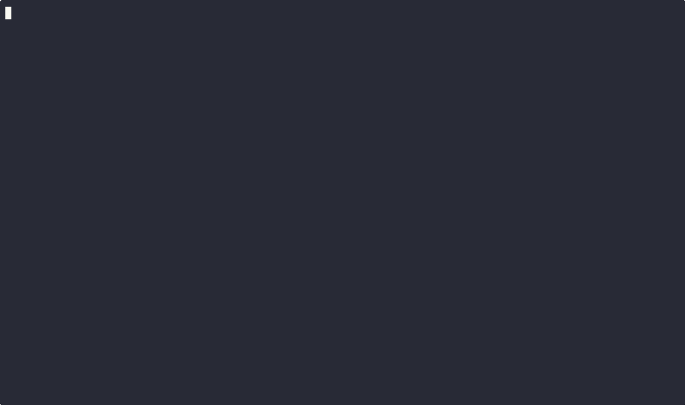

# 🦞 Lemmy — Your Terminal Lobster

> *Don't let your tokens go to waste, let Lemmy have a taste!*

<p align="center">
  
</p>

A terminal pet that grows in real time from your [OpenClaw](https://github.com/openclaw/openclaw) LLM token usage.

Every API call feeds Lemmy. Watch him evolve from a tiny **Hatchling** to an **Elder Kraken** as your agents work.

  

### Demo



---

## What's in the box

| Component | What it does |
|-----------|-------------|
| **`plugin/`** — `lemmy-feed` | OpenClaw plugin. Appends one NDJSON line per LLM completion to `~/.openclaw/logs/lemmy-usage.jsonl`. |
| **`src/`** — `lemmy-lobster` | Terminal UI (Node + [Ink](https://github.com/vadimdemedes/ink)). Tails the log file and renders your growing lobster. |

---

## Quick Start

### 1. Install the plugin

```bash
# Copy plugin into OpenClaw extensions
cp -r plugin/ ~/.openclaw/extensions/lemmy-feed/

# Restart gateway to load it
openclaw gateway restart
```

The plugin hooks `llm_output` and writes token metadata (no prompts, no content — just counts).

### 2. Install the CLI

```bash
npm install
npm run build
npm link    # or: npm install -g .
```

### 3. Run it

```bash
lemmy              # watch for new events (local)
lemmy replay       # replay from beginning + continue watching
lemmy doctor       # check paths and validate log file
lemmy add 5000     # inject synthetic tokens for testing
```

### 4. SSH mode (run from your laptop, tail a remote server)

```bash
lemmy ssh user@your-server
lemmy ssh user@your-server --replay
lemmy ssh user@your-server --ssh-args "-i ~/.ssh/mykey"
```

Uses your system `ssh` binary — no libraries, no dependencies.

---

## Stages

Lemmy evolves through 9 stages based on lifetime token consumption:

| Stage | Tokens |
|-------|--------|
| 🥚 Hatchling | 0 |
| 🦐 Dock Pup | 10,000 |
| 📦 Crate Hauler | 50,000 |
| ⚓ Wharf Boss | 250,000 |
| 🌊 Deep-Sea Legend | 1,000,000 |
| 🔱 Trench Lord | 10,000,000 |
| 🏔️ Abyssal Titan | 50,000,000 |
| 🐉 Leviathan | 250,000,000 |
| 👑 Elder Kraken | 1,000,000,000 |

Each stage has its own ASCII sprite with idle animation.

---

## Molt (Prestige)

Every 250,000 lifetime tokens, Lemmy is ready to **molt**. Press `m` when the READY tag appears:

- Molt count goes up
- Growth multiplier increases by +5% (compounding)
- Bonus XP accelerates future leveling
- Lifetime tokens are **not** reset — progression stays honest

---

## Keybindings

| Key | Action |
|-----|--------|
| `q` | Quit |
| `m` | Molt (when ready) |
| `r` | Reset session tokens |
| `?` | Help overlay |
| `c` | Show config/state file paths |
| `R` | Reconnect SSH stream |

---

## How it works

```
OpenClaw agent completion
        │
        ▼
  lemmy-feed plugin ──► ~/.openclaw/logs/lemmy-usage.jsonl
                                    │
                                    ▼
                          lemmy CLI (tail) ──► Terminal UI
```

The NDJSON log format:
```json
{
  "ts": "2026-03-04T05:35:38.710Z",
  "source": "openclaw",
  "provider": "anthropic",
  "model": "claude-sonnet-4-6",
  "input_tokens": 1200,
  "output_tokens": 800,
  "cache_read_tokens": 42000,
  "cache_write_tokens": 440,
  "total_tokens": 44440,
  "session_key": "agent:main",
  "agent_id": "my-agent"
}
```

No prompts. No content. Just metadata and token counts.

---

## File paths

| File | Purpose |
|------|---------|
| `~/.openclaw/logs/lemmy-usage.jsonl` | Token usage log (written by plugin) |
| `~/.lemmy/state.json` | Persistent game state |
| `~/.lemmy/config.json` | Config overrides |

---

## Requirements

- Node.js 20+
- OpenClaw (for the plugin — the CLI can also consume any NDJSON in the same format)

---

## License

MIT — see [LICENSE](LICENSE).
